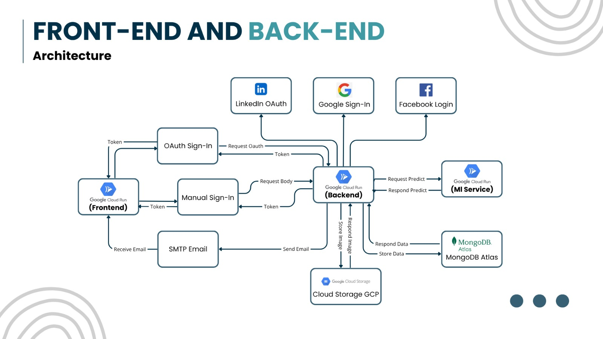

# Backend HireOn.AI

This is the backend service for the **HireonAI** platform. It is built using [Hapi.js](https://hapi.dev/) as the main framework and integrates MongoDB using Mongoose, [Machine Learning Service](https://github.com/hireonai/ml-services) for job recommendation, CV analysis and cover letter generation. The application supports JWT-based authentication, email notifications, Google Cloud Storage for file management, and includes auto-generated API documentation using Swagger.

---

## 🚀 Features

- RESTful API with Hapi.js
- MongoDB integration via Mongoose
- JWT Authentication
- Password hashing using bcrypt
- Email sending with Nodemailer
- File storage with Google Cloud Storage
- API documentation with Swagger (`hapi-swagger`)
- Input validation with Joi
- Error handling with Boom
- OAuth authentication with Bell
- Dev server with nodemon

---

## 📦 Tech Stack

| Category         | Package                                             |
| ---------------- | --------------------------------------------------- |
| Server Framework | @hapi/hapi, @hapi/cookie, @hapi/inert, @hapi/vision |
| Auth & Security  | jsonwebtoken, bcryptjs, bell                        |
| Validation       | joi                                                 |
| Database         | mongoose                                            |
| File Storage     | @google-cloud/storage                               |
| Email Service    | nodemailer                                          |
| API Docs         | hapi-swagger                                        |
| Others           | dotenv, axios, boom, nodemon                        |

---

## 🛠 Installation

```bash
# Clone the repo
git clone https://github.com/hireonai/backend-hireonai.git

# Navigate into the project directory
cd backend-hireonai

# Install dependencies
npm install
```

---

## 📸 Architecture

Below is the architecture diagram for the HireonAI backend:



---

## 🧪 Available Scripts

```bash
# Run in development mode
npm run dev

# Run in production mode
npm start

# Seed initial data (optional)
npm run seed
```

---

## 🔐 Environment Variables

Copy the `.env.example` file to `.env` and modify it according to your needs.

---

## 🔑 Google Cloud Storage Service Account

To use Google Cloud Storage, you need to create a service account key file.  
Follow these steps:

1. Create a service account key file for Google Cloud Storage:

   ```
   src/keys/gcs-service-account.json
   ```

2. Fill in the file with the following format and complete it with data from the Google Cloud Console:

   ```json
   {
     "type": "{{ your-service-account-type }}",
     "project_id": "{{ your-project-id }}",
     "private_key_id": "{{ your-private-key-id }}",
     "private_key": "{{ your-private-key }}",
     "client_email": "{{ your-client-email }}",
     "client_id": "{{ your-client-id }}",
     "auth_uri": "https://accounts.google.com/o/oauth2/auth",
     "token_uri": "https://oauth2.googleapis.com/token",
     "auth_provider_x509_cert_url": "https://www.googleapis.com/oauth2/v1/certs",
     "client_x509_cert_url": "{{ your-client-x509-cert-url }}",
     "universe_domain": "googleapis.com"
   }
   ```

---

## 📁 Project Structure

```
src/
├── configs/       # DB and environment config
├── constants/     # Global constants
├── data/          # Seed data
├── handlers/      # API request handlers
├── keys/          # Service account keys
├── middlewares/   # Custom middleware
├── controllers/   # API controllers
├── models/        # Mongoose schemas
├── routes/        # API route definitions
├── seeders/       # Data seeding scripts
├── services/      # Business logic
├── utils/         # Helpers (email, storage, etc)
└── server.js      # Main server entry point
```

---

## 📄 API Documentation

Once the server is running, navigate to:

```
http://localhost:5000/docs
```

You’ll see interactive API documentation generated using Swagger (`hapi-swagger`).

---

## 🧑‍💻 Author

Developed by **HireOn.AI Team**  
[GitHub](https://github.com/hireonai)

---

## 🐛 Issues

If you encounter any bugs or have feature requests, please open an issue at:

[https://github.com/hireonai/backend-hireonai/issues](https://github.com/hireonai/backend-hireonai/issues)

---

## 📄 License

This project is licensed under the **ISC License**.
